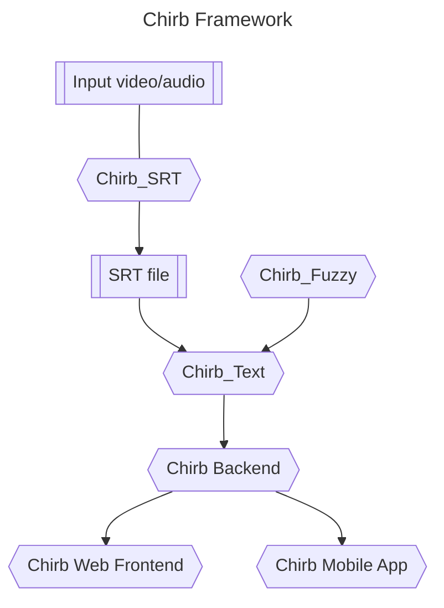

# Chirb

## A Short Introduction

Chirb is a project that transforms video/audio content into easily readable and comprehensive notes. It incorporates accurate punctuation and organizes the text into appropriate paragraphs.

We offer a service akin to YouTube Video Chapters. Our capability includes segmenting full video or audio content into appropriate chapters and identifying the timestamps marking the start and end of each chapter. This feature facilitates convenient navigation to specific segments within the video or audio content that you wish to access.

<!--

**Here are some ideas to get you started:**

🌈 Contribution guidelines - how can the community get involved?
👩‍💻 Useful resources - where can the community find your docs? Is there anything else the community should know?
🍿 Fun facts - what does your team eat for breakfast?
🧙 Remember, you can do mighty things with the power of [Markdown](https://docs.github.com/github/writing-on-github/getting-started-with-writing-and-formatting-on-github/basic-writing-and-formatting-syntax)
-->

## Chirb Framework and Components

- Chirb_SRT: convert video/audio into SRT format file
- Chirb_Text: convert SRT file to readable text
- Chirb_Fuzzy: reallocate annotated readable text in the SRT file
- Chirb Backend: use Restful API for Chirb modules
- Chirb Web Frontend: build a simple web frontend for Chirb
- Chirb Mobile App: build a simple mobile version for Chirb
